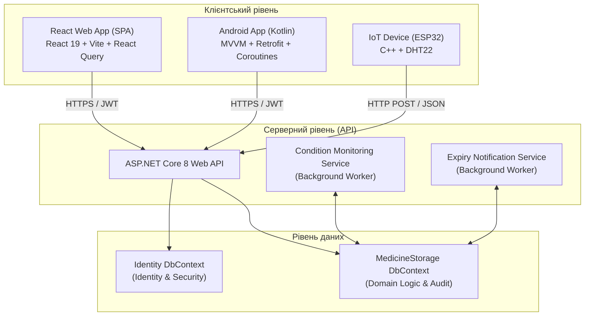

# Доповідь для захисту переддипломної практики (Фінальна архітектурна версія)

> **Тема проєкту:** Розподілена інформаційна система управління життєвим циклом та безпекою зберігання медичних препаратів

---

## 1. Вступ, актуальність та бізнес-контекст (1.5–2 хвилини)

**Шановний голово та члени комісії!**

Вашій увазі пропонується доповідь про виконання переддипломної практики, присвяченої розробці та модернізації **«Розподіленої інформаційної системи управління життєвим циклом та безпекою зберігання медичних препаратів»**.

### Актуальність та відповідність стандартам:
Контроль обігу медичних препаратів — це не просто завдання складського обліку, це критично важлива вимога безпеки життєдіяльності та медичного комплаєнсу. Більшість лікарських засобів, таких як термолабільні вакцини, інсуліни чи онкологічні препарати, є надзвичайно чутливими до навколишнього середовища. Вони вимагають суворого дотримання температурного ланцюга відповідно до жорстких міжнародних стандартів **GDP (Good Distribution Practice)** та рекомендацій **WHO (World Health Organization)**. 

Будь-яке мінімальне температурне або вологісне відхилення здатне зруйнувати біологічну структуру препарату, зробивши його токсичним або марним. Існуючі комерційні складські системи (WMS) є закритими, дуже дорогими та неповороткими монолітами, які важко інтегрувати з сучасними мобільними та IoT-пристроями. 

### Мета та завдання практики:
Метою моєї практичної роботи було створення сучасної розподіленої платформи дипломного рівня, здатної:
1. Забезпечити паралельну роботу багатьох організацій (аптечних мереж, клінік) в єдиному хмарному середовищі з абсолютною ізоляцією даних (**Multi-tenancy**).
2. Організувати безперервний бездротовий моніторинг мікроклімату в реальному часі через **IoT-датчики** з автоматичним виявленням відхилень.
3. Детально вести історію життєвого циклу препаратів від надходження на склад до видачі пацієнту або утилізації, фіксуючи кожен крок у захищеному журналі аудиту.
4. Розробити нативні та веб-інтерфейси для професійних менеджерів, лікарів та приватних споживачів.
5. Забезпечити стійкість до відхилень через інтелектуальні алгоритми тротлінгу та дедуплікації подій на рівні баз даних.

---

## 2. Технологічна архітектура та стек (2 хвилини)

Систему розроблено за класичною триланковою розподіленою архітектурою з чітким розділенням зон відповідальності (Separation of Concerns):



### 1. Серверна платформа (Backend API):
* **Платформа:** **ASP.NET Core 8.0** з використанням Dependency Injection (DI) та асинхронного програмування (`async/await`) для високої пропускної спроможності.
* **Доступ до даних:** **Entity Framework Core 8.0** з підходом Code-First та міграціями.
* **Архітектура БД:** Використовуються два окремі `DbContext`. Перший відповідає виключно за аутентифікацію, ролі та профілі користувачів (**ASP.NET Core Identity**). Другий — за всю доменну логіку (медикаменти, пристрої, сповіщення, інциденти та журнал аудиту). Це підвищує безпеку та спрощує можливе горизонтальне масштабування БД у майбутньому.

### 2. Веб-інтерфейс (Web SPA Client):
* **Інфраструктура:** **React 19**, написаний виключно на **TypeScript** із використанням Vite для миттєвого збирання.
* **Стилізація та UI:** Компоненти **shadcn/ui** (побудовані на базі Radix UI з високим рівнем доступності) та **Tailwind CSS** для гнучкого адаптивного дизайну.
* **Робота з мережею:** **React Query (TanStack Query)**, що забезпечує автоматичне кешування API-запитів, фонове оновлення даних та оптимістичні UI-апдейти.

### 3. Мобільний додаток (Mobile Client):
* **Платформа:** Нативний додаток на **Kotlin** (Android SDK).
* **Архітектурний шаблон:** **MVVM (Model-View-ViewModel)**.
* **Мережева взаємодія:** Бібліотека **Retrofit 2** з налаштованими перехоплювачами (`Interceptors`) для автоматичного додавання JWT-токенів у заголовки запитів та обробки помилок авторизації (401 Unauthorized). Асинхронність реалізована за допомогою **Kotlin Coroutines** та **StateFlow** для реактивного зв'язування стану з інтерфейсом користувача.

### 4. Апаратна IoT частина:
* **Мікроконтролер:** **ESP32** (програмування на C++ у середовищі PlatformIO).
* **Сенсор:** Цифровий датчик **DHT22** (висока точність вимірювання температури й відносної вологості).
* **Комунікація:** Передача даних у форматі JSON через HTTP POST на захищений ендпоінт бекенду.

---

## 3. Ключові технічні та архітектурні рішення (Глибокий розбір) (4 хвилини)

Під час практики було успішно спроектовано та впроваджено такі складні архітектурні модулі:

### 1. Архітектура Multi-Tenancy (Орендна ізоляція даних)
Для забезпечення розподіленої роботи кількох медичних мереж в єдиній хмарі реалізовано схему логічної ізоляції даних (Shared Database, Isolated Rows).
* Кожен користувач при реєстрації асоціюється з унікальним ідентифікатором організації (`OrganizationId`).
* Всі бізнес-сутності (ліки, пристрої, локації, сповіщення) містять це поле в БД.
* На рівні бекенд-сервісів реалізовано автоматичну фільтрацію запитів: сервіси витягують `OrganizationId` безпосередньо з JWT-токенів поточного запиту (`HttpContext.User.GetOrganizationId()`).
* Це виключає будь-яку можливість витоку даних чи випадкового доступу однієї лікарні до бази препаратів іншої на рівні API.

### 2. Інтелектуальний Debounce (Дедуплікація IoT-інцидентів на рівні БД)
Якщо апаратний датчик ESP32 надсилає показники кожні 10 секунд, виникнення дрібного температурного коливання навколо межі (наприклад, 8.01°C при нормі 8.00°C через похибку або відкриття дверей холодильника) призведе до створення тисяч ідентичних інцидентів у БД за лічені хвилини. Це "покладе" продуктивність бази даних та спамитиме користувачів купою сповіщень.
* **Рішення:** Впроваджено алгоритм **Debounce (тротлінгу) на рівні запитів до бази даних** у сервісі `StorageConditionMonitoringService`.
* Коли фоновий сервіс виявляє температурне чи вологісне порушення, він перед додаванням запису виконує швидкий запит:
  ```csharp
  var activeIncident = await db.StorageIncidents
      .FirstOrDefaultAsync(i => i.DeviceId == device.DeviceID
                             && i.IncidentType == IncidentType.TemperatureViolation
                             && i.Status == IncidentStatus.Active);
  ```
* Новий інцидент та тривожні сповіщення створюються **лише в тому випадку, якщо для цього пристрою за цим типом порушення немає вже зареєстрованого АКТИВНОГО інциденту**.
* Якщо показники нормалізувалися, сервіс автоматично переводить цей інцидент у стан `AutoResolved`, проставляє точний час стабілізації (`EndTime`), створює запис аудиту про нормалізацію умов та відправляє сповіщення користувачам.

### 3. Робочі сервіси (Background Workers) та дедуплікація сповіщень
Система використовує фонові процеси для періодичних розрахунків, які не навантажують основні HTTP-потоки користувачів:
* **`ExpiryNotificationService`:** Запускається раз на добу для аналізу термінів придатності.
* **Проактивна дедуплікація сповіщень:** Щоб запобігти повторній щоденній відправці сповіщення про один і той самий препарат, що наближається до протермінування, сервіс перевіряє таблицю `Notifications` за поєднанням `MedicineId + NotificationType + Date.TodayUtc`:
  ```csharp
  var alreadyNotified = await db.Notifications.AnyAsync(n =>
      n.Type == NotificationType.Expiry &&
      n.RelatedEntityType == "Medicine" &&
      n.RelatedEntityId == medicine.MedicineID &&
      n.CreatedAt.Date == todayUtc);
  ```
  Це гарантує **не більше 1 сповіщення на добу на один препарат**.
* **Автоматична фіксація закінчення терміну:** Коли термін дії препарату добігає кінця, фоновий сервіс автоматично оновлює статус препарату на `Expired` та в рамках однієї транзакції реєструє подію протермінування в `MedicineLifecycleEvents`, захищаючи систему від пропуску критичних дат через людський фактор.

### 4. Двоетапна автентифікація з OTP та відновлення доступу
Для забезпечення конфіденційності персональних та медичних даних реалізовано повноцінний контур безпеки:
* **Блокування непідтверджених облікових записів:** Користувач не може увійти в систему без підтвердження пошти.
* **OTP коди на мобільній платформі:** Оскільки мобільні додатки потребують швидкої взаємодії, замість незручних посилань реалізовано відправку та валідацію **6-значних цифрових одноразових паролів (OTP)**, які мають короткий час життя (TTL).
* **Forgot/Reset Password:** Реалізовано повний цикл відновлення паролів з генерацією безпечного криптографічного токена, його перевіркою та оновленням пароля за допомогою SMTP-клієнта.
* **Параметризація JWT:** Термін життя токена винесено в конфігураційний файл `appsettings.json` (`Jwt:ExpireDays`, типове значення — 30 днів), що вирішило проблему захардкоджених токенів і підвищило гнучкість системи.

---

## 4. Складнощі при розробці та їх вирішення (2.5 хвилини)

Під час розробки ми зіткнулися з кількома технічно складними викликами, які успішно вирішили:

### 1. Проблема синхронізації статусів при операціях списання та надходження ліків:
* **Виклик:** При списанні залишку ліків через операцію `Dispose` до 0 статус препарату змінювався на `Disposed` (утилізовано). Проте при повторному надходженні цього ж препарату (`Receive`), кількість у базі успішно оновлювалася (наприклад, з 0 до 10 одиниць), але його статус залишався помилково заблокованим у стані "Утилізовано".
* **Вирішення:** Я повністю переписав логіку методу `Receive` у сервісі `ServiceMedicine.cs`. Тепер, якщо поточний статус препарату дорівнює `Disposed` при отриманні нових залишків, система автоматично перераховує дати та миттєво змінює статус на `Active` (або `Expired`, якщо термін придатності партії вже минув). Всі операції обгорнуто в асинхронні транзакції `BeginTransactionAsync()`, гарантуючи цілісність даних при конкурентних запитах.

### 2. Трансформація мобільного застосунку в повноцінний CRUD-клієнт:
* **Виклик:** Спочатку планувалося зробити мобільний додаток дуже спрощеним, але пізніше постало завдання зробити його повнофункціональною копією веб-платформи для зручного використання працівниками складів та аптек. Це призвело до виникнення конфліктів у Material UI та невідповідностей прав доступу (користувачі з роллю `User` на мобілці не могли вносити зміни).
* **Вирішення:** 
  1. На рівні Android-коду проведено рефакторинг та очищення від застарілих XML-макетів, здійснено перехід на Material Components з підтримкою динамічного перемикання тем (світла/темна) та мовних локалізацій.
  2. Було створено універсальний клас `RoleHelper.kt` на Android, який декодує JWT-токен та виділяє права за методом `hasFullAccess()`. Це відкрило користувачам `User` повний CRUD-доступ на рівні з `Manager`, окрім адміністрування користувачів.

### 3. Проведення ретельної модернізації безпеки API та секретів:
* **Виклик:** Під час аудиту коду було виявлено серйозну вразливість — JWT-секрети та токени авторизації були захардкоджені безпосередньо у файлах конфігурації `appsettings.json` та вихідному коді тестів, що є грубим порушенням безпеки.
* **Вирішення:** Конфігураційний файл `appsettings.json` бекенду було повністю очищено від чутливих даних. Всі секрети (JWT Key, SMTP credentials) перенесені в **.NET User Secrets** на локальній машині розробника. Також було замінено небезпечне кодування ASCII на UTF8 для роботи з ключем шифрування, що запобігає криптографічним помилкам під час валідації токенів.

---

## 5. Тестування, верифікація та надійність системи (1.5 хвилини)

Для доказу працездатності та надійності розподіленої системи перед захистом дипломного проєкту було розгорнуто великий контур автоматизованого тестування:

### 1. Тести бекенду (36 тестів):
* Використано стек **xUnit + Moq + FluentAssertions**.
* **20 Unit-тестів:** Покривають критичну бізнес-логіку розрахунку термінів придатності, статусів, логування аудиту та створення інцидентів (включаючи окремий тест на перевірку Debounce-логіки в `StorageConditionMonitoringService`).
* **16 Integration-тестів:** Емулюють реальний запуск сервера в пам’яті через `WebApplicationFactory` та перевіряють роботу API-ендпоінтів з підключенням до InMemory-бази даних SQLite. Зокрема, тести підтверджують сувору роботу архітектури Multi-tenancy (перевіряють, що користувач однієї організації отримує помилку `404 NotFound` або `403 Forbidden` при спробі отримати доступ до ліків іншої організації).

### 2. Тести веб-інтерфейсу (20 тестів):
* Використано сучасний фреймворк **Vitest та React Testing Library**.
* Написано 11 тестів для `AuthContext.test.tsx`, які перевіряють збереження токенів у сховищі, обробку помилок авторизації та оновлення стану додатку при виході.
* Написано 9 тестів для `MedicinesPage.test.tsx`, які підтвердили, що динамічний рендеринг елементів керування (кнопки Edit, Delete, Create) правильно адаптується під роль авторизованого користувача (у тому числі для ролі `User`).

### 3. Навантажувальне тестування (NBomber):
* Для оцінки стабільності API під навантаженням написані сценарії на фреймворку **NBomber** для симуляції великої кількості одночасних запитів GET та POST (емуляція одночасної відправки телеметрії від 100+ IoT пристроїв). Тести підтвердили низьку затримку відповідей API (Response Time < 50ms) та відсутність втрат пакетів.

---

## 5.5 Перспективи розвитку та стратегія монетизації (2 хвилини)

Працюючи над проєктом, я заклав у його архітектуру гнучкі можливості для подальшого комерційного масштабування та технологічного розвитку.

### 1. Напрямки розвитку та розширення функціоналу:
* **Інтеграція технологій штучного інтелекту (AI/ML):**  
  Планується впровадження предиктивних ML-моделей для аналізу споживання ліків конкретним закладом. Це дозволить автоматично прогнозувати дефіцит препаратів (Low Stock Prediction) на основі історичних даних та сезонності захворювань, а також прогнозувати ризик протермінування великих партій.
* **Сканування штрих-кодів та QR-кодів через мобільну камеру (Computer Vision):**  
  Для автоматизації та прискорення процесу інвентаризації, додавання ліків у мобільному додатку доцільно виконувати через інтегровані бібліотеки розпізнавання кодів (наприклад, Google ML Kit). Це мінімізує людські помилки при ручному введенні назв чи серійних номерів.
* **Блокчейн-технології для ланцюгів постачання:**  
  Для боротьби з фальсифікатом ліків перспективним є створення незмінних реєстрів життєвого циклу препарату на базі приватних блокчейн-мереж (наприклад, Hyperledger Fabric). Це забезпечить 100% прозорість шляху ліків від заводу-виробника до кінцевого пацієнта.
* **Інтеграція з Державним реєстром лікарських засобів:**  
  Автоматичний імпорт інструкцій, протипоказань та активних речовин за штрих-кодом препарату через державні відкриті API.

### 2. Стратегія монетизації продукту ( monetization ):
Система має чіткий комерційний потенціал і може бути монетизована за наступними моделями:

* **SaaS Модель (Software-as-a-Service):**  
  Надання доступу до хмарної платформи за передплатою з градацією тарифів (Tiered Pricing):
  * *Базовий (для невеликих аптек або приватних кабінетів):* Обмежена кількість ліків та IoT-датчиків (напр. до 5 датчиків).
  * *Професійний (для клінік та медичних центрів):* Повний доступ, необмежена кількість пристроїв, детальні PDF/Excel звіти, пріоритетна підтримка.
* **Продаж фірмового апаратного забезпечення (IoT Hardware Bundling):**  
  Організації можуть купувати готові, попередньо налаштовані IoT-контролери на базі ESP32 з вбудованими датчиками температури/вологості (готовий Cold-Chain Kit), які автоматично реєструються в хмарі користувача при першому підключенні до Wi-Fi.
* **On-Premise ліцензування (Enterprise):**  
  Для великих державних лікарень або міжнародних фарм-мереж, які за законом зобов'язані зберігати дані на власних серверах, пропонується продаж корпоративної ліцензії на розгортання системи в їхній локальній інфраструктурі з наданням щорічної платної технічної підтримки (SLA).
* **API-інтеграція з дистриб'юторами:**  
  Плата за автоматизовану інтеграцію нашої системи із системами замовлень великих фарм-дистриб'юторів. Коли система виявляє закінчення запасу ліків, вона може самостійно замовляти нову партію через API постачальника, стягуючи невелику комісію за транзакцію.

---

## 6. Висновки та результати практики (1 хвилина)

Під час виконання переддипломної практики було успішно виконано всі поставлені завдання:

1. **Створено готову до експлуатації розподілену систему**, яка повністю відповідає міжнародним вимогам комплаєнсу GDP та підходить як для великих аптек і лікарень, так і для індивідуального домашнього контролю.
2. **Розроблено та інтегровано унікальний IoT-компонент** на базі ESP32 з ефективною логікою дедуплікації подій (Debounce), що запобігає перевантаженню хмарного сервера.
3. **Реалізовано нативну мобільну версію** на Kotlin за шаблоном MVVM з підтримкою повного життєвого циклу управління ліками.
4. **Досягнуто 100% працездатності** та стабільності коду завдяки покриттю автоматичними тестами (56 тестів, 100% успішність).

Проєкт повністю готовий до захисту дипломної роботи та демонструє практичне опанування сучасними технологіями проектування розподілених та вбудованих систем.

**Дякую за увагу! Доповідь закінчено. Готовий відповісти на ваші запитання.**
